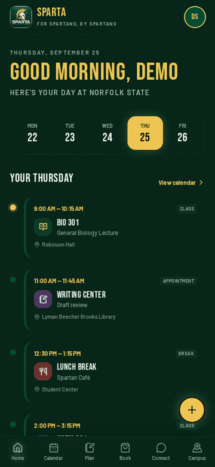

# SPARTA

SPARTA is a mobile-first student companion app for **Norfolk State University**. It gives students a warm, collegiate home for their day: a class timeline, a personal calendar planner, Writing Center booking, a staff provider view, classmate chats and shared study sessions, and campus info — all wrapped in the university's deep green and gold.



> SPARTA is a working MVP: accounts, cloud-saved calendars, booking, and chat are live. Demo student/staff sign-in is available so testers can explore without registering.

## Features

- **Home** — "Good morning" day view with a week date strip, class timeline, quick-action button, and campus photo banner.
- **Calendar** — day and week planner; add, edit, and delete events, saved per account in the cloud.
- **Plan** — study plan tools plus a syllabus date-extraction prototype (deterministic sample data, no AI yet).
- **Book** — Writing Center booking flow: purpose, details, optional attachment, conflict-free time slots, and confirmation that lands in the calendar.
- **Staff view** — provider toggle with availability settings and today's appointments; closed slots are hidden from student booking.
- **Connect** — private contact book (NSU student emails, opens your mail app to compose), direct and group chats, shared study sessions, and message-a-teacher shortcuts.
- **Campus** — dining, map, events, organizations, and health/library cards (sample data; health routing is safe-signposting only).
- **Accounts** — email/password and Google sign-in, student/staff roles, password reset, and clearly labeled demo accounts for testers.
- **Feedback** — in-app bug/suggestion form for testers.

## Specs

| Area | Details |
| --- | --- |
| Framework | TanStack Start v1 (React 19, Vite 7), file-based routing |
| Styling | Tailwind CSS v4 theme tokens in `src/styles.css`; shadcn/ui-style components on Radix primitives |
| Backend | Lovable Cloud (auth, database, row-level security) |
| Auth | Email/password + Google OAuth; roles stored in a separate `user_roles` table |
| Data tables | `profiles`, `user_roles`, `events`, `appointments`, `closed_slots`, plus Connect tables (contacts, conversations, messages, study sessions, feedback) |
| Design | Deep green `#004F36`, warm gold `#F6C945`, cream `#FFFDF7`, soft sage neutrals; Bebas Neue display + Barlow body; "Midnight Spartan" dark theme |
| Layout | Mobile-first, bottom navigation (Home · Calendar · Plan · Book · Connect · Campus), every core screen reachable in three taps |
| Testing | Demo student and demo staff sign-in buttons on the auth screen |

## Getting started

```bash
bun install   # or npm install
bun run dev   # or npm run dev
```

Then open the printed local URL (the dev server serves the app in development mode).

## Project structure

```text
src/
  components/        # Shared UI: cards, buttons, badges, section headers, bottom nav
  lib/               # Shared data helpers (calendar events, Connect data)
  routes/            # File-based routes: /, /calendar, /plan, /book, /connect, /campus, /staff, /auth
  styles.css         # Tailwind v4 theme tokens (colors, fonts)
```

## Roadmap ideas

- Real syllabus parsing with AI date extraction
- Live campus data (dining hours, maps, events)
- Notifications for bookings and chat messages
